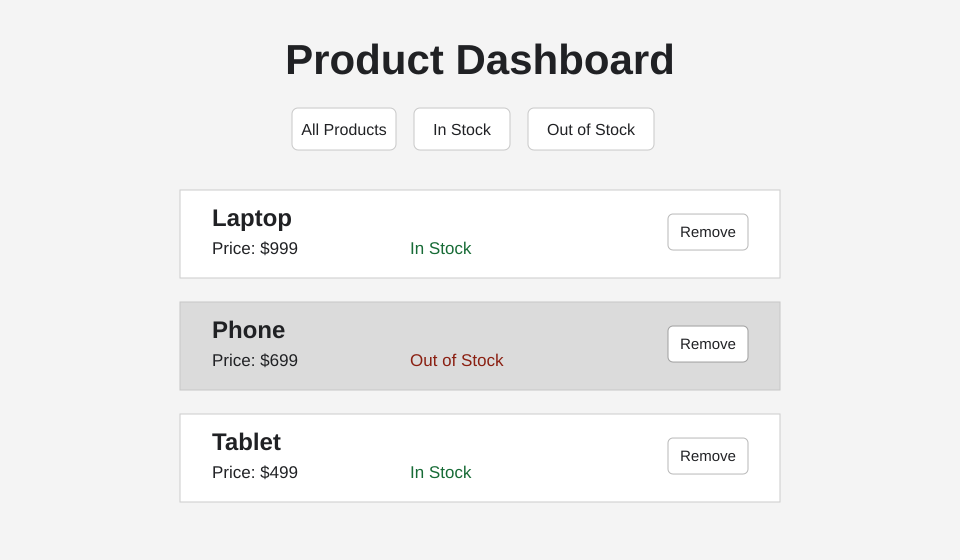

# Product Dashboard Manager

This React app displays a small product dashboard. It renders products from data, shows whether each product is in stock, styles out-of-stock products differently, and lets the user remove products from the dashboard.

## How to Run the Project

Install dependencies:

```bash
npm install
```

Start the development server:

```bash
npm run dev
```

Open the local URL shown in the terminal, usually:

```text
http://localhost:5173
```

Run the tests:

```bash
npm run test -- --run
```

## Screenshot



## Project Structure

- `src/App.jsx` stores the product list, filter state, and remove-product logic.
- `src/components/ProductList.jsx` renders the list of product cards.
- `src/components/ProductCard.jsx` renders each product and applies the out-of-stock class.
- `src/__tests__/indexTest.test.jsx` checks the dashboard title, product rendering, conditional styling, and remove button behavior.

## Notes

The code includes comments explaining the main logic for filtering products, rendering reusable product cards, and displaying empty states.
